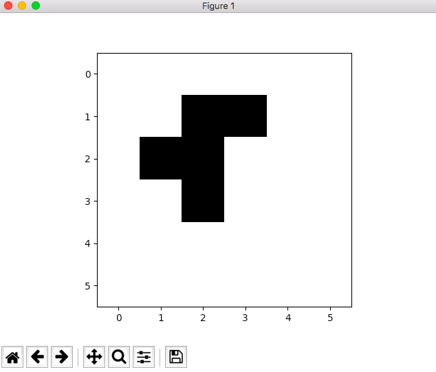

# Fonctionnalité 2 : Afficher l'univers

L'objectif de cette deuxième fonctionnalité est de pouvoir **afficher l'univers du jeu de la vie proprement**, quelqu'il soit.

On rappelle que pour ce MVP, il a été choisi un affichage simple du jeu sans interface graphique. En particulier, on se basera sur la bibliothèque `matplotlib` pour cela que vous avez déjà utilisé dans le cours SIP.

Vous devriez avoir ce type de visualisation

Nous vous laissons libre de choisir comment réaliser cette fonctionnalité et donc **A VOUS de JOUER!**

Vous venez de terminer une fonctionnalité donc n'oubliez pas de :

+ Faire un commit. 
+ Faire l'étape de revue et de synchro de votre code. 

Maintenant que nous avons les briques de base pour générer, initialiser et afficher l'univers du jeu de la vie, nous allons enrichir le paramétrage de l'initialisation en permettant de choisir parmi une large gamme d'amorces.
Il s'agit de la fonctionnalité [**Fonctionnalité 3** : Configurer un ensemble d'amorces.](./jeudelavie_S1_Amorces.md)

   