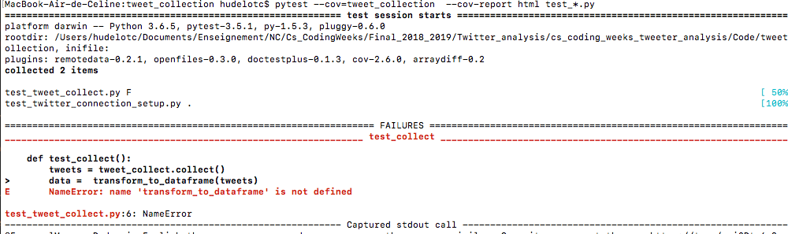
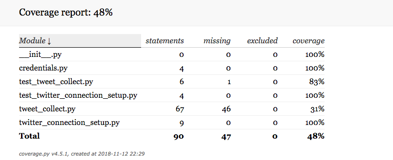
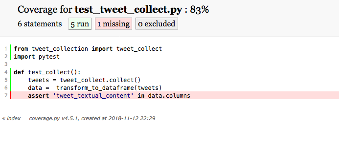

# Fonctionnalité 4 : Stocker les tweets


L'objectif de cette fonctionnalité est double.

+  Il s'agit d'une part de pouvoir stocker les tweets collectés sur disque. Nous nous contenterons pour cela d'une **écriture sur disque** des fichiers `json` qui sont renvoyées par notre système de collecte. 
+  Il s'agit ensuite de choisir une représentation des données pour pouvoir manipuler facilement ces différents fichiers et ainsi faciliter les phases de pré-traitement et d'analyse. Nous utiliserons pour cela la biblithèque [`pandas`](https://pandas.pydata.org/) et son concept de [`dataframe`](http://pandas.pydata.org/pandas-docs/stable/dsintro.html#dataframe) qui est très utilisée en analyse de données. C'est une des bibliothèques principales de l'écosystème data de python.

Nous allons ici encore procéder par étapes.


## Etape 1 : Stocker les tweets collectés sur disque.

Il s'agit ici d'écrire dans le module de collecte `tweet_collection` une fonction `store_tweets(tweets,filename):` permettant de sauvegarder sur disque les tweets collectés.

Cela peut sembler être une opération facile mais qui n'est pas automatique car elle nécessite une étape de [sérialisation](https://fr.wikipedia.org/wiki/S%C3%A9rialisation) dans un fichier ce que l'on peut faire avec la méthode `json.dump()` du module `json` de la bibiothèque standard python.

Pour vous aider vous pouvez regarder cette documentation :

 + [https://realpython.com/python-json/](https://realpython.com/python-json/)
 + [http://sdz.tdct.org/sdz/serialisez-vos-objets-au-format-json.html](http://sdz.tdct.org/sdz/serialisez-vos-objets-au-format-json.html)

En plus d'écrire le programme de sérialisation des tweets collectés dans un fichier, vous pouvez aussi réfléchir à l'information que vous voulez réellement stocker et écrire dans votre fichier. 

 + En effet, rappelez-vous !  Il y a [beaucoup d'informations](https://gist.github.com/dev-techmoe/ef676cdd03ac47ac503e856282077bf2) dans l'objet qui est renvoyé par tweepy et il n'est peut être pas utile pour ce projet de tout stocker. Il faut à minima sauvegarder le texte du tweet, sa date, les hashtags, son id mais d'autres informations peuvent être très utiles.
 + De plus, il vous faut un mécanisme pour pouvoir savoir à quel candidat ou personnalité le tweet ou l'ensemble des tweets fait référence. Vous pouvez par exemple mettre cela en oeuvre via un mécanisme de structuration et de nommage de vos fichiers *intelligents*

 
## Etape 2 : Création d'un dataframe `pandas` avec l'information utile.
 
Il s'agit maintenant d'utiliser pandas pour créer un `dataframe` contenant l'information que nous allons utiliser pour l'analyse en elle-même.

Pour cela, il faut d'abord que vous installiez [`pandas`](https://pandas.pydata.org/) soit en ligne de commande en utilisant la commande `pip3 install pandas` soit directement depuis votre éditeur.

Si vous ne connaissez pas cette bibliothèque, prenez les 15 min nécessaires pour faire ce [très court tutorial](https://pandas.pydata.org/pandas-docs/stable/10min.html).
Vous pouvez aussi prendre le temps de réaliser ce [notebook python](./Notebook/LAB1_Manipulation_de_données_Pré-traitements.ipynb) dont la correction est [ici](./Notebook/LAB1_Manipulation_de_données_Pré-traitementsCorrection.ipynb)


Ecrivez maintenant une fonction qui prend en entrée un objet de type `Status`, le type de retour des données renvoyées par `tweepy` et qui construit à partir de cet objet un `dataframe` pandas avec les informations que vous souhaitez garder.


Nous allons ici nous familiariser avec l'approche de développement [**TDD (Test Driven Development)**](https://fr.wikipedia.org/wiki/Test_driven_development) qui consiste à spécifier le comportement attendu via un test avant de l’implémenter effectivement. Le principe est donc d'écrire en premier lieu le test et ensuite le code le plus simple possible qui permette au test de passer et donc de satisfaire le comportement spécifié. Le code peut ensuite être amélioré. L'idée est donc de se focaliser sur les fonctionnalités plutôt que sur le code.

Le **TDD (Test Driven Development)** est un développement dirigé par les tests et donc la première ligne de votre programme doit être dans un fichier de tests. Dans notre cas, nous utiliserons le module [`pytest`](https://docs.pytest.org/en/latest/) qu'il faut donc ajouter à votre projet. Le principe du TDD repose sur 3 étapes complémentaires.
 
   + Première étape (**<span style='color:red'>RED</span>**) : Ecrire un premier test qui échoue.
   + Deuxième étape (**<span style='color:green'>GREEN</span>**) : Ecrire le code le plus simple qui permet de passer le code.
   + Troisième étape (**REFACTOR**) : Améliorer le code source.


Nous allons donc appliquer cette méthode à la fonctionnalité de la création de la grille du jeu 2048.

#### **<span style='color:red'> ETAPE RED</span>**

Notre premier test va consister à tester que lors de sa création, la dataframe pandas possède bien l'ensemble des champs voulus (c'est-à-dire l'ensemble des informations voulues pour l'analyse).
Dans notre cas, supposons que seul le champ `text` nous intéresse et qu'il est stocké dans la colonne 'tweet_textual_content' du dataframe .  Alors on pourra écrire un test comme

```PYTHON
from twitter_predictor.twitter_collect import collect
from pytest import *


def test_collect():
    tweets = tweet_collect.collect()
    data =  transform_to_dataframe(tweets)
    assert 'tweet_textual_content' in data.columns

```
Ce test vérifie que votre dataframe est bien formé.

Recopier ce code dans un fichier `test_nomdumoduleatester.py`
Ce test doit échouer, puisqu'en l'état actuel du projet, le code pour `transform_to_dataframe` n'existe pas et on a donc l'erreur suivante lors de l'exécution du code <span style='color:red'>`ImportError: cannot import name 'transform_to_dataframe'`<span>

#### **<span style='color:green'> ETAPE GREEN</span>**

On va maintenant écrire le code qui permet de faire passer ce test le plus rapidement au vert.

Ecrivez ce code et re-tester.
 

#### **<span style='color:black'> ETAPE REFACTOR</span>**
   
La dernière étape consiste en une étape de [refactoring](https://refactoring.com/), à mettre en place si nécessaire.   

Le [refactoring](https://en.wikipedia.org/wiki/Code_refactoring)(ou réusinage de code) est un principe de programmation qui consiste à changer la structure interne d’un logiciel sans en changer son comportement observable. C'est une étape qui doit toujours être exécutée quand les différents tests sont au vert et qui n'est pas obligatoire. Elle doit surtout permettre d'améliorer la **qualité du code** par exemple en améliorant :
 
 + **la conception** : decoupage en fonctions, modules ou classes afin de rendre votre code le plus simple possible.
 + **la lisibilité du code** : il faut ici prendre le temps d'appliquer les principes du [clean code](https://cleancoders.com/cart) introduit par Robert C. Martin dans l'ouvrage du même nom et dont un des principe est celui des boy-scouts (*« The Boy Scout Rule »*): *« Toujours laisser un endroit dans un état meilleur que celui où vous l’avez trouvé »*.
 
Dans notre cas, une des premiers principes est de vérifier du bon nommage (variables, fonctions, packages, classes et cie) et de la présence de commentaires dans notre code. 
 
 Vous trouverez [ici](https://github.com/zedr/clean-code-python#objects-and-data-structures) quelques principes du clean code transposé au langage python. Prenez le temps de lire rapidement ce site et appliquer ces différents principes au code que vous allez écrire.
 
Dans cette étape **<span style='color:black'> ETAPE REFACTOR</span>**, on peut aussi travailler à l'optimisation des performances du programme si cela s'avère vraiment nécessaire.
 

#### **ATTENTION**

1. **Après cette étape, n'oubliez pas de relancer les tests pour vérifier que le comportement de votre code n'a pas changé et que tout est encore bien AU VERT !**


2. On vient ici de terminer la réalisation de l'étape *Création d'un dataframe `pandas` avec l'information utile* et il convient donc de **committer ce changement dans votre gestionnaire de version avec un message de commit explicite reprenant l'objectif de l'étape**. Pensez aussi à mettre à jour votre dépôt distant.


#### **A VOUS de JOUER!** 

On vous maintenant permettre la création d'un dataframe pandas avec uniquement les informations utiles. à partir d'un fichier json.
Ecrivez le code correspondant à cette tâche et tester le (ou alors appliquer à nouveau l'approche TDD pour cela).


## A propos de la couverture de code par vos tests

Une couverture de code par les tests (code coverage) nous permet de connaître le pourcentage de notre code qui est testé et donc cela permet d'avoir une idée de ce qui reste d'ombre dans notre projet.

En règle générale, on considère qu'une couverture de code supérieure à 80% est signe d'un projet bien testé et auquel il sera alors plus facile de rajouter de nouvelles fonctionnalités.

Pour connaitre le taux de couverture de notre projet, nous pouvons utiliser des bibliothèques python [`coverage`](https://coverage.readthedocs.io/en/v4.5.x/) et [`pytest_cov`](https://pypi.org/project/pytest-cov/) qu'il faut donc installer soit en ligne de commande soit depuis votre IDE.

`pip3 install coverage`

`pip3 install pytest-cov`

Il faut ensuite vous placer dans le répertoire de votre projet et lancer la commande suivante :

`pytest --cov=tweet_collection --cov-report html test_*.py`

Cette commande permet de tester les fichiers contenus dans le dossier 'tweet_collection', crée un rapport en html et le place dans le répertoire `htmlcov` et utilise les tests qui sont dans ce répertoire et qui sont de la forme `test_[caracteres].py`.

L'ouverture du fichier `index.html`dans le répertoire `htmlcov`vous permet de visualiser un bilan du test de couverture qui devrait être bon dans la mesure où nous avons utilisé l'approche TDD. Un clic sur chacun des fichiers permet aussi d'avoir un bilan propre à chaque fichier.



La visualisation du fichier `index.html` généré.




Le détail pour chaque module.



## A propos de la gestion des versions

<span style='color:blue'> Pour toute la suite du projet, il vous est demandé de :</span> 

+ <span style='color:blue'>Faire un commit dès que la réalisation d'une fonctionnalité ou d'une sous-fonctionnalité est finie.</span> 
+ <span style='color:blue'>Tagger à la fin de chaque journée votre dernier commit </span> 
+ <span style='color:blue'>Pousser (Push) votre code vers votre dépôt distant sur GitLab.</span> 
+ <span style='color:blue'>Faire un test de couverture de code à la fin de chaque journée et de pousser le bilan obtenu vers votre dépôt distant sur GitLab.</span>


Nous avons maintenant terminé le Sprint 1 et nous pouvons passer à la  [**Fonctionnalité 6** : Quelques informations statistiques.](./S2_Pretraitement.md)


 
 
 
 
 


 