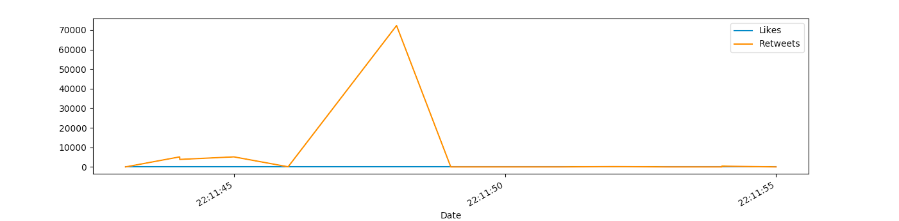

# Fonctionnalité 6 : Visualisation de l'évolution d'une caractéristique.


Les tweets sont diffusés en continu et il peut être intéressant de regarder leur évolution temporelle.

Là aussi, on peut tirer parti de la bibliothèque `pandas` qui a un moyen de construire des séries temporelles.

Par exemple, si nous voulons comparer sur une période donnée l'évolution du nombre de `retweets` versus le nombre de `Like`, nous pouvons le faire comme ci-dessous.

```
tfav = pd.Series(data=data['Likes'].values, index=data['Date'])
tret = pd.Series(data=data['RTs'].values, index=data['Date'])

# Likes vs retweets visualization:
tfav.plot(figsize=(16,4), label="Likes", legend=True)
tret.plot(figsize=(16,4), label="Retweets", legend=True)

plt.show()
```

Ce qui donne 



## A vous de jouer !

Ajouter des fonctions permettant de visualiser l'évolution de caractéristiques d'intérêt dans votre corpus de tweets.

**Pensez à tester et à documenter votre code !!!**

Cette étape terminera votre fonctionnalité mais aussi le Sprint courant.
Il faudra donc :

+ <span style='color:blue'>Faire un commit.</span> 
+ <span style='color:blue'>Tagger votre dernier commit </span> 
+ <span style='color:blue'>Pousser (Push) votre code vers votre dépôt distant sur GitLab.</span> 
+ <span style='color:blue'>Faire un test de couverture de code et pousser le bilan obtenu vers votre dépôt distant sur GitLab.</span>


Nous pouvons maintenant passer à l'analyse d'opinions avec  [**Fonctionnalité 8** : Prise en main de Textblob](./S3_textblob.md). 


