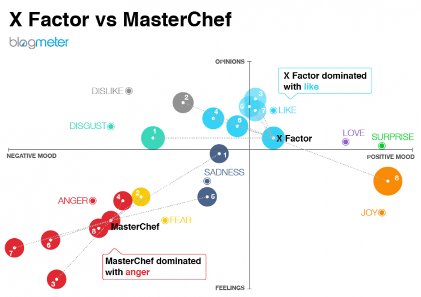

# Analyse d'opinions dans Twitter ? 

L'**objectif** de ce mini-projet est de développer, de manière très incrémentale, un système d'analyse d'opinions sur une personne, un évènement, une marque dans des tweets. L'exemple donné dans le cadre de ce projet est un application d'opinions sur une personnalité politique mais vous êtes libres de l'adapter même si par exemple l'actualité américaine est un bon terrain de jeu en ce moment.

Source : [Celi](https://www.celi.it/en/solutions/opinion-mining/)

Au travers de ce projet, vous allez découvrir l'écosystème python pour travailler avec Twitter et faire de l'analyse de données textuelles mais aussi plusieurs principes du mouvement dit du [*Software Craftmanship*](https://www.octo.com/fr/publications/20-culture-code). 

## Organisation du mini-projet

Ce mini-projet est découpé en plusieurs objectifs, eux-même découpés en  **sprints** et **fonctionnalités**. La notion de sprint fait référence à la [méthode agile](https://fr.wikipedia.org/wiki/M%C3%A9thode_agile). Un sprint correspond à un intervalle de temps pendant lequel l’équipe projet va compléter un certain nombre de tâches.

Ce travail de découpage a été fait pour vous mais c'est une des premières étapes à faire pour tout projet de développement logiciel, au moins de manière macroscopique. **Pensez-y la semaine prochaine!**

### **Objectif 1 (MVP): Notre premier analyseur de Tweets** 

Le premier objectif est de constuire et d'implémenter une version simple de l'outil d'analyse de tweets que l'on pourrait qualifier de **[MVP (Minimum Viable product)](https://medium.com/creative-wallonia-engine/un-mvp-nest-pas-une-version-simplifi%C3%A9e-de-votre-produit-89017ac748b0)**. 

Ce concept de MVP a été popularisé par Eric Ries, l'auteur de [The Lean Startup](http://theleanstartup.com/), une approche spécifique du démarrage d'une activité économique et du lancement d'un produit. La figure ci-dessous permet de bien expliquer ce concept.

 + **Sprint 0** :
	 + [Installation du socle technique.](./Sprint0Installbis.md)
	 + [Analyse des besoins.](./Sprint0Analyse.md) 
	 + [Refexion autour de la conception.](./Sprint0Conception.md)

 + **Sprint 1 : Collecte des données avec [Tweepy](http://www.tweepy.org/)**
 
 	+ [**Fonctionnalité 1** : Prise en main de tweepy : se connecter à l'API Twitter.](./S1_twitterconnect.md)
 	+ [**Fonctionnalité 2** : Collecter des tweets avec Tweepy - Prise en main.](./S1_twittercollect.md)
 	+ [**Fonctionnalité 3** : Collecter des tweets relatifs à une entité.](./S1_twittercollectquery.md)
 	+ [**Fonctionnalité 4** : Stocker les tweets.](./S1_twitterstorage.md)
 	+ [**Fonctionnalité 5** : Charger un ensemble de tweets collectés.](./S1_twitterload_data.md)
 		
 + **Sprint 2** : **Traitement et Analyse des tweets**
 	+ [**Fonctionnalité 6** : Quelques informations statistiques.](./S2_Pretraitement.md)
 	+ [**Fonctionnalité 7** : Visualisation de l'évolution d'une caractéristique.](./S2_TweetTimeSeries.md)
 		
 + **Sprint 3** : **Ajout de l'analyse de l'opinion avec [Textblob](https://textblob.readthedocs.io/en/dev/)**
 	+ [**Fonctionnalité 8** : Prise en main de Textblob](./S3_textblob.md)
 	+ [**Fonctionnalité 9** : Prise en compte de l'opinion](./S3_opinion.md)

 + **Sprint 4** : **Visualisation simple de l'analyse avec [seaborn](https://seaborn.pydata.org/)**	

 	+ [**Fonctionnalité 10** : Afficher le résultat de l'analyse.](./S4_displayresult.md)
 	

### Objectif 2 : Visualisation plus avancée des résultats de l'analyse (Amélioration du MVP) 

+  **Sprint 5** : **Une application de visualisation de l'analyse avec [Dash](https://plot.ly/)**
	+ [**Fonctionnalité 11** : Votre première application avec Dash](./S5_dash.md) 

+  **Sprint 6** : **Representing the word usages with [WordCloud](https://github.com/amueller/word_cloud)!** 
	+ [**Fonctionnalité 13** : Prise en main de WordCloud](./S6_wordcloud.md)
	+ [**Fonctionnalité 14** : WordCloud sur votre ensemble de tweets](./S6_wordcloudtweet.md)

### Objectif 3 : Ajout de l'analyse des sentiments par apprentissage 

+ **Sprint 7** : **Comprendre rapidement l'apprentissage supervisé**.
	+ [**Fonctionnalité 14** : Mise en place d'une chaîne d'apprentissage supervisé](./S7_learning.md)
	+ [**Fonctionnalité 15** : Récupération de données d'apprentissage en Français](./S7_corpus.md)

 

