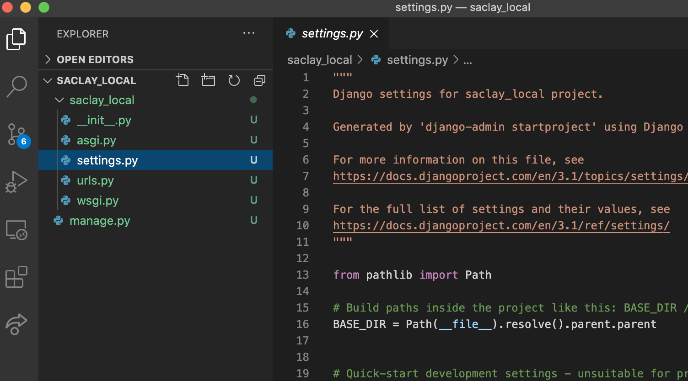
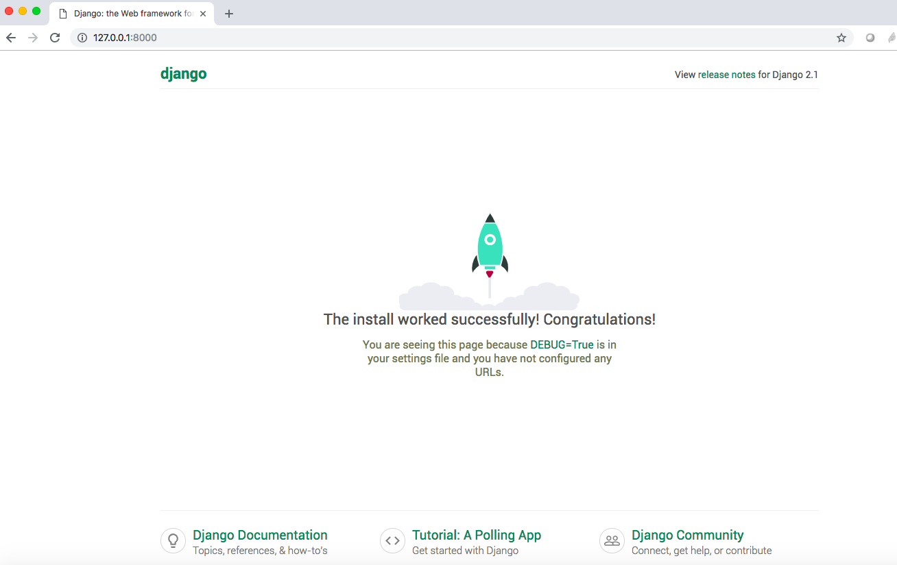

# Fonctionnalité 1 : Prise en main de Django - Création d'un projet Django


L'objectif de cette fonctionnalité est d'installer le framework Django et de créer un premier projet *Django* à l'aide du framework et initiant ainsi votre application **saclay local**.

## Etape 1 : Installation de Django

La première étape consiste en l'installation de Django. On peut le faire facilement via l'utilitaire Pypi avec la commande 
`pip install django` ou `pip3 install django`

:point_right: [Je n'arrive pas à installer Django](https://github.com/LoicPoullain/je-code/blob/master/probleme-installation-django.md).

Vous pouvez tester l'installation de Django en testant la commande `import django` dans votre console python et en demandant quelle est la version avec la commande `django.get_version()`


## Etape 2 : Créer la structure de votre projet Django

A l'aide de votre terminal, placer vous à la racine du répertoire de votre projet git `saclaylocal` et tapez la commande suivante :

`django-admin startproject saclay_local`

Cette commande a permis de créer la structure de votre projet Django et vous devriez avoir maintenant cette structure dans votre projet VSCode.





Vous devrier donc avoir un répertoire `saclay_local` contenant un fichier `manage.py`et un package python `saclay_local` avec les modules `settings.py`, `urls.py`, `wsgi.py` et `asgi.py` (et un fichier `__init__.py`)


 + Le premier répertoire racine `saclay_local` n’est qu’un contenant pour votre projet. 
+ `manage.py` est un utilitaire en ligne de commande qui vous permet d’interagir avec ce projet Django de différentes façons. Vous trouverez toutes les informations nécessaires sur `manage.py` [ici](https://docs.djangoproject.com/fr/3.1/ref/django-admin/) 
+ Le sous-répertoire `saclay_local` correspond au package Python effectif de votre projet. C’est le nom du paquet Python que vous devrez utiliser pour importer ce qu’il contient
+ `__init__.py` est un fichier vide qui indique à Python que le répertoire précédent doit être considéré comme un package.
+ `settings.py` est un fichier pour les réglages et configuration de ce projet Django. Une documentation est disponible [ici](https://docs.djangoproject.com/fr/3.1/topics/settings/).
+ `urls.py` est le fichier dans lequel sera fait les déclarations des URL de ce projet Django, c'est une sorte de *table des matières*  de votre site Django. Voir [ici](https://docs.djangoproject.com/fr/3.1/topics/http/urls/)
+ `wsgi.py` : un point d’entrée pour les serveurs Web compatibles WSGI pour déployer votre projet. La documentation est disponible [ici](https://docs.djangoproject.com/fr/3.1/howto/deployment/wsgi/)
+ `asgi.py` : un point d’entrée pour les serveurs Web compatibles aSGI pour déployer votre projet. Voir [ici](https://docs.djangoproject.com/fr/3.1/howto/deployment/asgi/) pour plus de détails.


Nous reviendrons sur ces différents fichiers dans la suite de ce projet.


## Etape 3 : Lancer le serveur Django

Déplacez-vous dans le premier dossier `saclay_local`.

```
cd saclay_local
```

Vous pouvez maintenant lancer le serveur de développement Django avec la commande 

```
python manage.py runserver
```

:point_right: [Je n'arrive pas à lancer le serveur Django](https://github.com/LoicPoullain/je-code/blob/master/probleme-lancement-serveur-django.md).

Un problème ? Lisez le message et **faites ce qui vous est conseillé**.

Avec cette commande, vous avez démarré le serveur de développement de Django, un serveur Web léger entièrement écrit en Python qui est inclus avec Django de façon à vous permettre de développer rapidement, sans avoir à vous occuper de la configuration d’un serveur de production tant que vous n’en avez pas besoin.


L'exécution du script `python manage.py runserver`  affiche un ensemble d'information et en particulier vous donne l'addresse url du serveur de développement.

`Starting development server at http://127.0.0.1:8000/`

Vous pouvez maintenant ouvrir cette url (très souvent http://127.0.0.1:8000/) avec votre navigateur et vous devriez avoir cette page.




## Etape 4 : Associer une base de données à votre projet Django `saclay_local`


Dans ce projet, nous utiliserons `SQLite` comme gestionnaire de based de données. Il s’agit du choix le plus simple. SQLite est inclus dans Python, vous n’aurez donc rien d’autre à installer pour utiliser ce type de base de données. 

Nous nous rappellons aussi deux tutoriaux qui pourront vous être utiles pour la suite :

* [Tutoriel de Zeste de savoirs](https://zestedesavoir.com/tutoriels/1294/des-bases-de-donnees-en-python-avec-sqlite3/)
* [Tutoriel ISN](https://fiches-isn.readthedocs.io/fr/latest/sqlite.html)

Nous vous rappelons aussi ce que vous avez fait pendant le cours de SIP : [ici](https://wdi.centralesupelec.fr/1CC1000/QueryingADatabase) et [ici](https://wdi.centralesupelec.fr/1CC1000/SolutionsTD2FDDkIBEFds) ainsi que le travail sur le [TD Pistus](https://wdi.centralesupelec.fr/1CC1000/Pistus).


Pour un projet plus conséquent, vous pouvez bien-sûr utiliser une base de données plus résistante à la charge comme `PostgreSQL`. 

Si vous souhaitez utiliser une autre base de données, il faut suivre les consignes de ce [tutoriel](https://docs.djangoproject.com/fr/3.1/topics/install/#database-installation) et ce [guide](https://docs.djangoproject.com/fr/3.1/ref/settings/#std:setting-DATABASES). La [partie dédiée](https://openclassrooms.com/fr/courses/4425076-decouvrez-le-framework-django/4630835-creez-un-nouveau-projet#/id/r-4630761) du tutoriel d'OpenClassRooms est aussi une bonne alternative.

Ouvrez le fichier `settings.py` qui contient actuellement le code suivant :

```python
"""
Django settings for saclay_local project.

Generated by 'django-admin startproject' using Django 3.1.3.

For more information on this file, see
https://docs.djangoproject.com/en/3.1/topics/settings/

For the full list of settings and their values, see
https://docs.djangoproject.com/en/3.1/ref/settings/
"""

from pathlib import Path

# Build paths inside the project like this: BASE_DIR / 'subdir'.
BASE_DIR = Path(__file__).resolve().parent.parent


# Quick-start development settings - unsuitable for production
# See https://docs.djangoproject.com/en/3.1/howto/deployment/checklist/

# SECURITY WARNING: keep the secret key used in production secret!
SECRET_KEY = '7^t9$%*vgiiv@3xu3#_j8*92at!##4+0$+%)9)7_f@r7hzs(xr'

# SECURITY WARNING: don't run with debug turned on in production!
DEBUG = True

ALLOWED_HOSTS = []


# Application definition

INSTALLED_APPS = [
    'django.contrib.admin',
    'django.contrib.auth',
    'django.contrib.contenttypes',
    'django.contrib.sessions',
    'django.contrib.messages',
    'django.contrib.staticfiles',
]

MIDDLEWARE = [
    'django.middleware.security.SecurityMiddleware',
    'django.contrib.sessions.middleware.SessionMiddleware',
    'django.middleware.common.CommonMiddleware',
    'django.middleware.csrf.CsrfViewMiddleware',
    'django.contrib.auth.middleware.AuthenticationMiddleware',
    'django.contrib.messages.middleware.MessageMiddleware',
    'django.middleware.clickjacking.XFrameOptionsMiddleware',
]

ROOT_URLCONF = 'saclay_local.urls'

TEMPLATES = [
    {
        'BACKEND': 'django.template.backends.django.DjangoTemplates',
        'DIRS': [],
        'APP_DIRS': True,
        'OPTIONS': {
            'context_processors': [
                'django.template.context_processors.debug',
                'django.template.context_processors.request',
                'django.contrib.auth.context_processors.auth',
                'django.contrib.messages.context_processors.messages',
            ],
        },
    },
]

WSGI_APPLICATION = 'saclay_local.wsgi.application'


# Database
# https://docs.djangoproject.com/en/3.1/ref/settings/#databases

DATABASES = {
    'default': {
        'ENGINE': 'django.db.backends.sqlite3',
        'NAME': BASE_DIR / 'db.sqlite3',
    }
}


# Password validation
# https://docs.djangoproject.com/en/3.1/ref/settings/#auth-password-validators

AUTH_PASSWORD_VALIDATORS = [
    {
        'NAME': 'django.contrib.auth.password_validation.UserAttributeSimilarityValidator',
    },
    {
        'NAME': 'django.contrib.auth.password_validation.MinimumLengthValidator',
    },
    {
        'NAME': 'django.contrib.auth.password_validation.CommonPasswordValidator',
    },
    {
        'NAME': 'django.contrib.auth.password_validation.NumericPasswordValidator',
    },
]


# Internationalization
# https://docs.djangoproject.com/en/3.1/topics/i18n/

LANGUAGE_CODE = 'en-us'

TIME_ZONE = 'UTC'

USE_I18N = True

USE_L10N = True

USE_TZ = True


# Static files (CSS, JavaScript, Images)
# https://docs.djangoproject.com/en/3.1/howto/static-files/

STATIC_URL = '/static/'
```

Prenez le temps de lire ce programme et essayez de comprendre sa logique. Faut-il modifier quelque chose ?

Si nous utilisions un autre système de gestion de base de données, il faudrait modifier la constante `DATABASES`. En effet :

 + Notre moteur gestionnaire de base de données ne serait plus  `sqlite3` mais `posrgresql`. Il faudrait donc modifier la valeur associée à la clé `'ENGINE'`par ` 'django.db.backends.postgresql'`. 
 + Vous pourriez aussi spécifier votre nom d'utilisateur avec la clé `'USER'` et mettre à jour le nom de votre base de données avec la clé `'NAME'`.

 
Ce sont des étapes inutiles ici mais dont vous devez avoir connaissance pour la gestion d'autres systèmes de gestion de base de données.


Notez également le réglage INSTALLED_APPS au début du fichier. Cette variable contient le nom des applications Django qui sont actives dans cette instance de Django. Les applications peuvent être utilisées dans des projets différents, et vous pouvez empaqueter et distribuer les vôtres pour que d’autres les utilisent dans leurs projets.

Par défaut, INSTALLED_APPS contient les applications suivantes, qui sont toutes contenues dans Django :

* `django.contrib.admin` – Le site d’administration. Vous l’utiliserez très bientôt.
* `django.contrib.auth` – Un système d’authentification.
* `django.contrib.contenttypes` – Une structure pour les types de contenu (content types).
* `django.contrib.sessions` – Un cadre pour les sessions.
* `django.contrib.messages` – Un cadre pour l’envoi de messages.
* `django.contrib.staticfiles` – Une structure pour la prise en charge des fichiers statiques.


Ces applications sont incluses par défaut par commodité parce que ce sont les plus communément utilisées.


Certaines de ces applications utilisent au moins une table de la base de données, donc il faut créer les tables dans la base avant de pouvoir les utiliser. Il faut donc lancer la commande 

```bash
python manage.py migrate
```
 
 
Cette commande examine `INSTALLED_APPS` et crée les tables de base de données nécessaires en fonction des réglages de base de données dans votre fichier `mysite/settings.py` ainsi que des migrations de base de données contenues dans l’application.


Vous verrez apparaître un message pour chaque migration appliquée. 
 
Vous pouvez si le souhaitez lancer le client en ligne de commande de votre base de données pour afficher les tables créées par Django.  (dans notre cas `sqlite` ne possède pas vraiment de client, mais vous pourriez quand même utiliser la commande `sqlite3` et pour accéder au table `.schema`). 

 
Nous verrons plus tard comment définir le schéma de la base de données.


 

Nous avons fini cette fonctionnalité donc n'oubliez pas de : 

+ <span style='color:blue'>Faire un commit sur votre dépôt local.</span> 
+ <span style='color:blue'>Mettre en place le processus de revue et de synchronisation de votre code.</span> 


Nous pouvons maintenant passer à la [**Fonctionnalité 2** : Une application pour le catalogue de produits.](./S1_F2_djangoapp.md)

