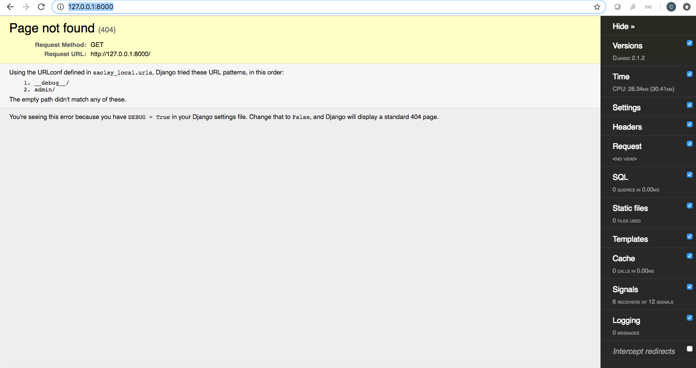
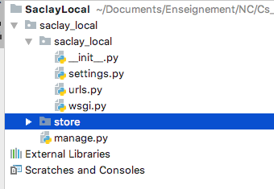

# Fonctionnalité 2 : Une application pour le catalogue de produits


En Django, un site web est considéré comme un projet, composé de plusieurs applications.  Une application est un package Python qui respecte certaines contraintes dont nous parlerons plus tard. Django est livré avec un utilitaire (`python manage.py startapp`) qui génère automatiquement la structure des répertoires de base d’une application, ce qui vous permet de vous concentrer sur l’écriture du code, plutôt que sur la création de répertoires. Un projet Django peut contenir plusieurs applications et une application peut apparaître dans plusieurs projets.

Pour vous donner un exemple de ce qu'est une application, dans notre cas, pour le projet `saclay_local`, nous pourrions par exemple avoir :

+ une application pour le **catalogue** de produits qui s'occupera de stocker les différents produits en vente et de les afficher sur le site web.
+ une application pour la **vente** des produits en tant que tel : la constitution d'un panier et son paiement.
+ une application de **gestion des comptes utilisateurs** et de leur droit.
+ une application d'**admnistration du site**.
+ une application pour mettre en oeuvre un **système de contact**.
+ ...

Nous allons ici nous intéresser à l'ajout d'une application **catalogue** à notre projet `saclay_local`.

## Etape 1 : Pour commencer, importons une application tierce à notre projet

Pour se familiariser avec la notion d'application Django, nous allons installer une applicaton tierce, l'application [Django Debug Toolbar](https://github.com/jazzband/django-debug-toolbar) et l'associer à notre projet `saclay_local`. C'est une application qui fait partie des outils indispensables du développeur django car elle permet de traquer facilement, au travers d'une barre d'outils, les entrées-sorties de votre application (requêtes http, requêtes bdd, sessions...).

C'est une application python que l'on peut donc très simplement installer à l'aide de la commande `pip install django-debug-toolbar` .

Une fois installée, il faut maintenant l'associer à notre projet `saclay_local` ce qui se fait très simplement à l'intérieur du fichier `settings.py` en le modifiant avec les lignes de code ci-dessous :

```python
INSTALLED_APPS = [
    'django.contrib.admin',
    'django.contrib.auth',
    'django.contrib.contenttypes',
    'django.contrib.sessions',
    'django.contrib.messages',
    'django.contrib.staticfiles',
    'debug_toolbar',
]
```

L'application Django Debug Toolbar doit pouvoir accéder aux tables de la base de données pour y lire certains réglages et il y a d'autres petits réglages à faire pour pouvoir utiliser cette application comme expliqué dans la documentation d'installation de l'application [ici](https://django-debug-toolbar.readthedocs.io/en/stable/installation.html).

En particulier, votre fichier `settings.py` doit être actualisé avec :

```python
MIDDLEWARE = [
    # ...
    'debug_toolbar.middleware.DebugToolbarMiddleware',
    # ...
]

INTERNAL_IPS = ['127.0.0.1']

```

Et le fichier `urls.py` doit aussi être modifié de la façon suivante :

```python
from django.conf import settings
from django.urls import include, path

urlpatterns = []

if settings.DEBUG:
    import debug_toolbar
    urlpatterns = [
        path('__debug__/', include(debug_toolbar.urls)),
    ] + urlpatterns
```

Si vous relancer le serveur de developpement Django, vous devriez avoir une page d'erreur ainsi que l'application de Debug sur la droite.





# Etape 2 : Créer une application `store`

Nous allons maintenant créer et ajouter à notre projet `saclay_local`, une application qui  sera responsable du catalogue des produits locaux à afficher sur le site.

Pour cela, nous pouvons à nouveau nous reposer sur les fonctionnalités de Django et de la commande `django-admin`.

Plaçons-nous au même niveau que le fichier `manage.py`de notre projet avec un terminal et tapons la commande suivante :

`django-admin startapp store `


Django vient de créer au même niveau que le package `saclay_local` le répertoire `store` comme ci-dessous


 

Ce repertoire contient :

+ `migrations/` : contient les fichiers qui modifient la structure de la base de données.
+ `__init__.py` : déclare que ce répertoire est un package.
+ `admin.py` : configuration de l'espace d'administration.
+ `apps.py` : configuration de l'application 
+ `models.py` : modèles de l'application
+ `tests.py` : fichier qui contiendra les tests.
+ `views.py` : vues de l'application.

```
store/
    __init__.py
    admin.py
    apps.py
    migrations/
        __init__.py
    models.py
    tests.py
    views.py
```


Il vous reste maintenant à ajouter votre application `store` à votre projet
`saclay_local` en ajoutant ce code dans le fichier `settings.py`comme vu tout à l'heure

```python
INSTALLED_APPS = [
    'store.apps.StoreConfig',
    # ...
]

``` 
Prenons un peu le temps de regarder cette structuration. Dans les choses importantes, vous pouvez noter l'existence d'un fichier `tests.py` créé d'office par l'application. Nous n'avons pas beaucoup parlé des tests pour l'instant mais nous y reviendrons très vite.

On voit aussi que le code est structuré en `models` et en `views` ce qui est très classique en conception d'applications web ou même plus généralement dès lors que l'on developpe des applications d'interfaces graphiques.

Cette façon de procéder fait référence à un motif d'architecture logicielle appelé [**Modèle-vue-contrôleur ou MVC**](https://fr.wikipedia.org/wiki/Mod%C3%A8le-vue-contr%C3%B4leur) dédié aux interfaces graphiques, datant de 1978 et devenu très populaire. Ce motif est composé de trois types de modules ayant trois responsabilités différentes : les modèles, les vues et les contrôleurs :

 + Un **modèle (Model)** qui  contient les données à afficher.
+ Une **vue (View)** qui contient la présentation de l'interface graphique.
+ Un **contrôleur (Controller)** qui contient la logique concernant les actions effectuées par l'utilisateur.

L'idée principale est le [partage de responsabilité](https://en.wikipedia.org/wiki/Separation_of_concerns). 

Django implémente une pattern un peu différent que s'appelle **MVT** (Modèle - Vue - Template) dans lequel :

+ **Le Modèle** interagit avec la base de données c'est à dire qu'il cherche et récupère dans la base de données les données nécessaires à l'application.  
+ **Le template** est un fichier HTML *gabarit* qui est analysé et exécuté par le framework Django, en lien avec une vue, pour être présenté au visiteur du site. 
+ **La Vue** a la responsabilité de recevoir des requêtes HTTP et d'y répondre de manière intelligible par le navigateur. Chaque vue est associé à un url.

Pour bien comprendre son principe et son fonctionnement, prenez le temps de lire [ce tutorial](https://openclassrooms.com/fr/courses/1871271-developpez-votre-site-web-avec-le-framework-django/1871426-le-fonctionnement-de-django) du site OpenClassRooms.


#### <span style="color: #26B260">A ce stade du projet, vous avez atteint le JALON 12 : Se familiariser avec le design pattern MVC </span> 


Nous avons maintenant terminé cette fonctionnalité. Nous avons ajouté à notre projet une application `store` qui ne fait rien pour l'instant.

## A propos de la gestion des versions

<span style='color:blue'> Pour toute la suite du projet, il vous est demandé de :</span> 

+ <span style='color:blue'>Faire un commit dès que la réalisation d'une fonctionnalité ou d'une sous-fonctionnalité est finie.</span> 
+ <span style='color:blue'>Tagger à la fin de chaque journée votre dernier commit </span> 
+ <span style='color:blue'>De faire une revue de code au sein de l'équipe pour chaque fonctionnalité.</span>
+ <span style='color:blue'>De mettre le code stable sur la branche `master`.</span>
+ <span style='color:blue'>Pousser (Push) le code vers votre dépôt distant sur GitLab.</span> 
+ <span style='color:blue'>Faire un test de couverture de code à la fin de chaque journée et de pousser le bilan obtenu vers votre dépôt distant sur GitLab.</span>

Et nous allons maintenant compléter notre application en passant à la [**Fonctionnalité 3** : Ajout de la page d'accueil et d'une vue.](./S1_F3_vue.md)


