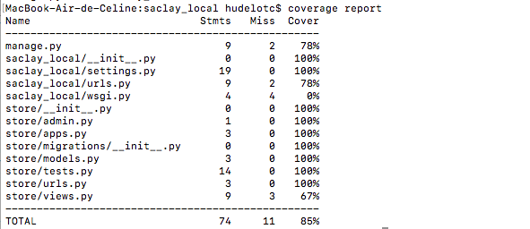

# Fonctionnalité 4 : Ajouter des produits dans le modèle - Une nouvelle vue


Nous allons maintenant ajouter une nouvelle vue qui liste des produits en vente sur notre application.

## Etape 1 : Ajout de données dans `models.py`

On n'utilisera pas de base de données dans cette étape et on se contentera d'ajouter 3 produits d'un même producteur dans le fichier `models.py`

```python
PRODUCERS = {
  'ferme_viltain': {'name': 'Ferme_de_Viltain'},
}


PRODUCTS = [
  {'name': 'yaourth_vanille', 'producers': [PRODUCERS['ferme_viltain']]},
  {'name': 'yaourth_marron', 'producers': [PRODUCERS['ferme_viltain']]},
  {'name': 'jus_de_pomme', 'producers': [PRODUCERS['ferme_viltain']]}
]
```

> ### Pour aller plus loin : à lire seulement
>
> Dans l'exemple ci-dessus, les modèles ont été créés sous la forme de dictionnaire python. Dans la vraie vie, nous utiliserions plutôt la notion de `classe` venant du paradigme de programmation objet. 
> Typiquement, il faudrait pour notre application définir une classe `Producer` et une classe `Product`. 
> 
> Dans notre cas, on pourrait par exemple avoir le code suivant :
> 
> ```python
> from django.db import models
> 
> 
> class Producer (models.Model):
>     name = models.CharField(max_length=200)
> 
> 
> class Product(models.Model):
> 	name = models.CharField(max_length=200)
>     producer = models.ForeignKey(Producer, on_delete=models.CASCADE)
> ```
> 
> Dans ce cas, chaque modèle est représenté par une `classe` qui hérite de django.db.models.Model. Chaque modèle possède des variables de classe, chacune d’entre elles représentant un champ de la base de données pour ce modèle.
> 
> Chaque champ est représenté par une instance d’une classe particulière. Par exemple, on utilise `CharField` pour les champs de type caractère. Cela indique à Django le type de données que contient chaque champ.
> 
> Le nom de chaque instance de `Field` (par exemple, `name` ou `producer`) est le nom du champ en interne. Vous l’utiliserez dans votre code Python et votre base de données l’utilisera comme nom de colonne.
> 
> Certaines classes `Field` possèdent des paramètres obligatoires. La classe `CharField`, par exemple, a besoin d’un attribut `max_length`. Ce n’est pas seulement utilisé dans le schéma de base de la base de données, mais également pour valider les champs, comme nous allons voir prochainement.
> 
> 
> Finalement, nous définissons une relation, en utilisant `ForeignKey`. Cela indique à Django que chaque produit (`Product`) n’est relié qu’à un seul `Producer`. Django propose tous les modèles classiques de relations : plusieurs-à-un, plusieurs-à-plusieurs, un-à-un.
> 
> 
> Ce petit morceau de code décrivant les modèles fournit beaucoup d’informations à Django. Cela lui permet de :
> 
> * Créer un schéma de base de données pour cette application.
> * Créer une API Python d’accès aux bases de données pour accéder aux objets `Product` et `Producer`.
> 
> 
> Pour cela, il faudra indiquer à notre projet que l’application `store` est installée.
> 
> 
> Pour inclure l’application dans notre projet, nous avons besoin d’ajouter une référence à sa classe de configuration dans le réglage `INSTALLED_APPS`. La classe `StoreConfig` se trouve dans le fichier `store/apps.py`, ce qui signifie que son chemin pointé est 'store.apps.StoreConfig'. Modifiez le fichier `saclaylocal/settings.py` et ajoutez ce chemin pointé au réglage `INSTALLED_APPS`. Il doit ressembler à ceci dans ce cas:
> 
>  ```python
>  INSTALLED_APPS = [
>     'polls.apps.StoreConfig',
>     'django.contrib.admin',
>     'django.contrib.auth',
>     'django.contrib.contenttypes',
>     'django.contrib.sessions',
>     'django.contrib.messages',
>     'django.contrib.staticfiles',
> ]
> ```
> 
> Django sait qu’il doit inclure l’application `store`.
> 
> La commande 
> 
> ```bash
> python manage.py makemigrations store
> ```
> 
> Avec cette commande, vous indiquez à Django que vous avez effectué des changements à vos modèles (dans ce cas, vous en avez créé) et que vous aimeriez que ces changements soient stockés sous forme de migration.
> 
> Les migrations sont le moyen utilisé par Django pour stocker les modifications de vos modèles (et donc de votre schéma de base de données), il s’agit de fichiers sur un disque. 
> 
**Pour la suite du tutoriel, nous utiliserons pour le moment la représentation sous forme de dictionnaires mais vous pourrez évidemment retenir ce principe pour plus tard ou pour votre propre projet, ce qui vous permettra beaucoup plus de modularité.**


## Etape 2 : Ajout d'une vue

Appliquer la même prodécure que dans la fonctionnalité précédente pour :

+ ajout d'une url dans `store/urls.py`
+ ajout d'une vue dans `views.py`
+ récupération des données du modèle

**Cette partie nécessite de la réflexion et du travail en autonomie. N'hésitez pas à chercher sur google et à [regarder la doc de django](https://docs.djangoproject.com/en/3.1/intro/tutorial01/)**.

On essaiera ici à nouveau de mettre en oeuvre la technique TDD. 

Vous devez avoir ceci.


## Etape 3 : couverture de code par vos tests

Une couverture de code par les tests (code coverage) nous permet de connaître le pourcentage de notre code qui est testé et donc cela permet d'avoir une idée de ce qui reste d'ombre dans notre projet.

En règle générale, on considère qu'une couverture de code supérieure à 80% est signe d'un projet bien testé et auquel il sera alors plus facile de rajouter de nouvelles fonctionnalités.

Pour connaitre le taux de couverture de notre projet, nous pouvons utiliser des bibliothèques python, en particulier [`coverage`](https://coverage.readthedocs.io/en/v4.5.x/install.html), qu'il faut donc installer soit en ligne de commande soit depuis votre IDE.

`pip3 install coverage`

Pour tester le taux de couverture de votre projet Django, il suffit donc de taper la commande :

`coverage run --source='.' manage.py test`

Puis la commande `coverage report` vous permet d'afficher un bilan et un état de la couverture de votre code.




#### <span style="color: #26B260">A ce stade du projet, vous avez atteint le JALON 5 : Je sais mettre en oeuvre un mécanisme de couverture de code par des tests </span> 


## A propos de la gestion des versions

<span style='color:blue'> Pour toute la suite du projet, il vous est demandé de :</span> 

+ <span style='color:blue'>Faire un commit dès que la réalisation d'une fonctionnalité ou d'une sous-fonctionnalité est finie.</span> 
+ <span style='color:blue'>Tagger à la fin de chaque journée votre dernier commit ainsi qu'à la fin d'une fonctionnalité ou d'un sprint </span> 
+ <span style='color:blue'>Faire des revues de code régulières et synchroniser vos dépôts</span> 
+ <span style='color:blue'>Faire un test de couverture de code à la fin de chaque journée ou de chaque fonctionnalité et de pousser le bilan obtenu vers votre dépôt distant sur GitLab.</span>


vous pouvez maintenant passer à la [**Fonctionnalité 5** : Transmission d'information dans une requête .](./S2_F5_addparameters.md)


