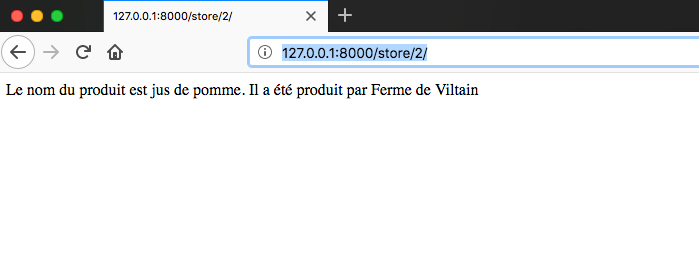

# Fonctionnalité 5 : Transmission d'information dans une requête 

L'objectif de cette fonctionnalité est d'ajouter deux nouvelles vues à notre projet :

 + Une vue pour afficher les informations sur le producteur d'un produit.
 + Une vue pour afficher les résultats d'un formulaire de recherche comme par exemple la recherche de produit.

## Etape 1 : Ajouter une vue pour afficher les informations sur le producteur d'un produit
 
En vous inspirant du [tutoriel](https://docs.djangoproject.com/fr/1.11/intro/tutorial03/#writing-more-views) de Django ou de celui d'[OpenClassRooms](https://openclassrooms.com/fr/courses/4425076-decouvrez-le-framework-django/4631210-passez-des-arguments-a-une-vue), ajoutez à votre application une vue, en mode TDD, pour permettre d'afficher des informations sur un produit donné.

Typiquement, pour l'url `http://127.0.0.1:8000/store/2/, vous devez avoir le site ci-dessous.

+ Ajouter votre fichier à votre dépôt git.
+ Faire un commit
+ Pousser (Push) votre code vers votre dépôt distant sur GitLab. 

 
## Etape 2 : Afficher les résultats d'un formulaire

Nous voulons maintenant afficher les résultats d'une requête comme par exemple `http://127.0.0.1:8000/store/search/?query=Ferme_de_Viltain`

Ecrire la vue permettant de répondre à ce type de requête. On appliquera ici aussi l'approche TDD ou on ajoutera les tests à l'application permettant de maintenir une bonne couverture de notre code.

Nous arrivons donc ici à la fin de notre MVP. 

#### A ce stade du projet, vous avez atteint le JALON 6 : un premier sprint complet de développement logiciel en groupe  et  JALON 10 : Concevoir et implémenter un MVP 

Il vous faudra cependant avant de passer à la suite consolider la code et notamment assurer une bonne couverture par les tests dès que celle-ci est possible. 
Notamment à ce stade, il faut :

* Que vous puissiez facilement lancer et executer une démonstration de votre code (par exemple pour faire un démo à votre client et pour obtenir des premiers retour utilisateurs.
* Il faut aussi, à ce stade, que votre code puisse être facilement utiliser par une personne tierce et ce au travers de son partage par son dépôt Gitlab. 

Pour cela, il faut d'une part nettoyer et commenter votre code en vue de son partage et il faut aussi vous mettre à la place d'une personne qui vaudrait tester votre projet. La bonne manière pour faire cela est de documenter le mieux possible le fichier `README.md`de votre dépôt. Ce dernier devrait permettre à une personne de cloner votre dépôt et de lancer votre code en un minimum d'étapes.

Prenez le temps nécessaire pour faire cette étape. Il s'agit notamment là d'un vrai travail de groupe.

####  JALON 13 : rendre son projet exploitable et réutilisable  

Et on peut maintenant passer à l'[objectif 2](./S3_F6_model.md).

   