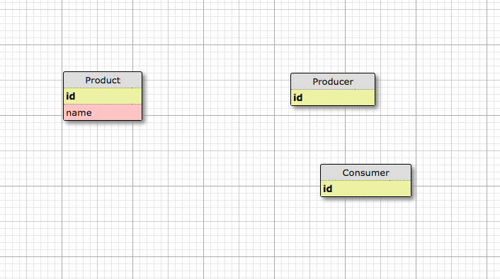

# Fonctionnalité 6 : Un modèle SQL avec SQLDesigner

L'objectif ici est de créer le modèle de votre base de données c'est à dire construire le diagramme SQL ou relationnel qui représentera les différentes tables de votre base de données, les différents champs et les relations entre les bases. 

Pour le faire de manière visuelle, vous pouvez utiliser l'outil [SQL Designer](http://ondras.zarovi.cz/sql/demo/). La figure ci-dessous est une esquisse de ce que pourrait être votre modèle.

Concevez donc votre modèle et commitez-le. 

Nous pouvons maintenant créer notre modèle et nous allons pouvoir le faire avec Django qui est aussi un [ORM](https://fr.wikipedia.org/wiki/Mapping_objet-relationnel). Vous avez déjà utiliser un ORM en SIP (SQL Alchemy). Il s'agit de la [**Fonctionnalité 7** : Création de notre modèle avec l'ORM Django](./S3_F7_ORM.md) 

 