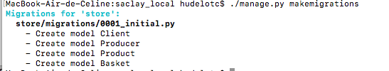
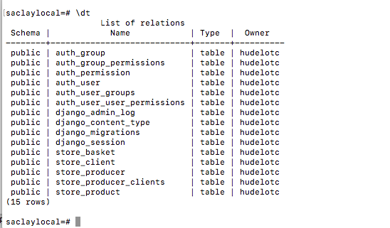

# Fonctionnalité 8 : Mise en place des migrations entre Django et la base de données

L'objectif ici est de mettre en place la [migration](https://en.wikipedia.org/wiki/Schema_migration) de votre modèle Django vers votre base de données.

Ce sera très simple car Django le fait pour nous. Il suffit en effet d'executer la commande

 `python manage.py makemigrations`
 
 Vous devriez avoir ceci.
 
 

Vous devez avoir de nouveaux fichiers qui se sont créés dans votre projet comme par exemple le fichier `0001_initial.py` qui s'est ajouté dans le répertoire `migrations`.

Il vous faut ensuite exécuter ces migrations par la commande :

`python manage.py migrate`

 Vous devriez avoir ceci.
 
 

<!--Vous pouvez vérifier que les tables se sont bien créées dans la base PostgreSQL en allant dans la console psql (tapez `psql`) dans un terminal et en tapant la commande `\dt` dans le terminal qui permet de lister les tables.

On voit que les tables `store_basket`, `store_client`, `store_producer`, `store_producer_clients`, `store_product` sont bien dans la base. Elles sont préfixées par le nom de l'application, ici `store`.
-->
Vous pouvez passer maintenant à la fonctionnalité [**Fonctionnalité 9** : Utilisation de la console Django pour ajouter des données](./S4_F9_ajoutdonnees.md)