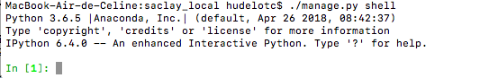
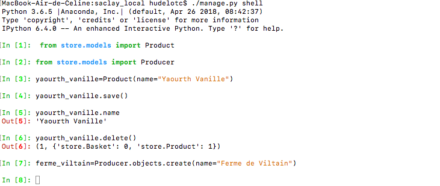

# Fonctionnalité 9 : Utilisation de la console Django pour ajouter des données

Ici, nous allons voir comment nous pouvons utiliser la console de Django pour intéragir avec la base de données et ajouter des entrées en ligne de commande.

Pour lancer la commande, il suffit de taper `python manage.py shell` . Cette commande nous ouvre une console Ipython.

## Etape 1 : ajouter des données dans la base

A partir de cette console, vous pouvez ajouter (`save()` ou `create()) ou supprimer (`delete()`) des données comme dans l'exemple ci-dessous.

Utiliser la console pour alimenter votre base de données.

## Etape 2 : Les Query sets

Un QuerySet est une liste d'objets d'un modèle donné. C'est ce qui va nous permettre de lire, trier et organiser, des données présentes dans une base de données.

On peut :
 
 + Lister tous les objets avec la commande `Mabase.objects.all()`
 + Créer des objets : ``Mabase.objects.create(...)`
 + Filtrer des objets avec la commande : `Mabase.objects.filter(...)`
 + Classer les objets avec la commande : `Mabase.objects.order_by(...)`
 
 La documentation complète est disponible [ici](https://docs.djangoproject.com/fr/2.1/ref/models/querysets/).
 
 Prenez le temps de manipuler un peu votre base et vos données et vous pouvez ensuite passer à la [**Fonctionnalité 10** : Mettre à jour les vues pour afficher les données de la base de données](./S5_F10_updateviews.md)
 
 
 
 