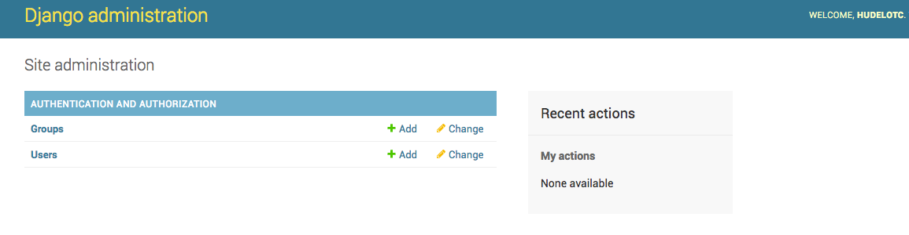
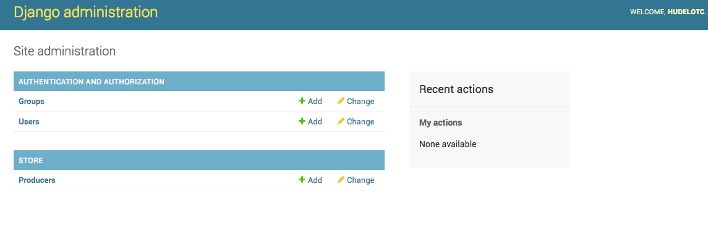

# Fonctionnalité 13 : Administrer notre application


Django possède par défaut une interface d'administration.


Lancez le serveur et allez à  `http://127.0.0.1:8000/admin`. Vous arrivez sur l'interface d'administration. Pour y accéder, il faut avoir un compte utilisateur, ce que l'on fait avec la commande :

`python manage.py createsuperuser`


Une fois le compte crée, nous pouvons maintenant relancer le serveur et rentrer dans cette interface d'administration (`http://127.0.0.1:8000/admin`).



Vous pouvez ajouter autant de nouveaux collaborateurs que vous le souhaitez depuis cette page. Chacun possède sa propre page permettant de modifier ses coordonnées.


Vous pouvez aussi configurer cette interface d'administration via le fichier `admin.py` qui a été généré automatiquement. Vous pouvez par exemple ajouter une table à cette interface en modifiant ce fichier comme ci-dessous:

```python
from django.contrib import admin
from .models import Producer

admin.site.register(Producer)
``` 


 
 
 
 Prenez le temps de vous faire un tour sur les possibilités de cet interface d'administration.
 
 
 