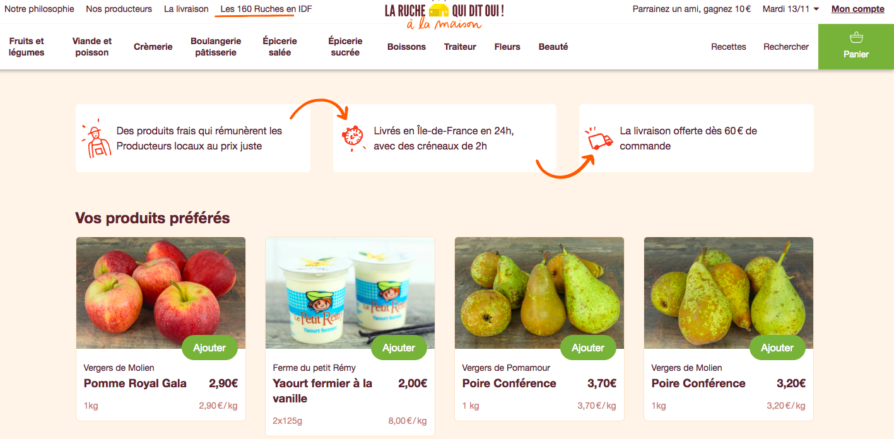

## Semaine 1 - Dévelopment d'une application Web en Django

**Le Comptoir Local de Saclay : Un site web pour l'achat en ligne de paniers de produits locavores.**

L'**objectif** de ce mini-projet est de développer, de manière très incrémentale, un prototype de ce que pourrait être un site web d'achat en ligne de paniers de produits locaux à l'image de [*La Ruche qui dit oui*](https://laruchequiditoui.fr/fr) ou [*La Ruche qui dit oui à la maison*](https://alamaison.laruchequiditoui.fr/).

Au travers de ce projet, vous decouvrirez les bases de la programmation web en python, avec le framework [Django](https://www.djangoproject.com/) ainsi plusieurs principes du mouvement dit du [*Software Craftmanship*](https://www.octo.com/fr/publications/20-culture-code). 

## Django et pourquoi Django ?

**Django** est un framework entièrement Python destiné au web au même titre que :

 + [Flask](http://flask.pocoo.org/) dont plusieurs tutoriels sont disponibles [ici](https://realpython.com/tutorials/flask/)
 + [TurboGears](http://www.turbogears.org/)
 + [Web2py](http://www.web2py.com/init/default/index)
 + ...

**Django** est un framework très complet et qui dispose d'une très grande communauté et est donc très [documenté](https://docs.djangoproject.com/en/2.1/). 
Des [exemples de codes](https://djangosnippets.org/) et des [packages réutilisables](https://djangopackages.org/) sont aussi disponibles.
 
> _Ce projet est inspiré et une adaptation du très bon cours de Céline Martinez Sanchez sur  OpenClassRooms : [Découvrez le framework Django !](https://openclassrooms.com/fr/courses/4425076-decouvrez-le-framework-django)._

## Organisation du mini-projet

Ce mini-projet est découpé en plusieurs objectifs, eux-même découpés en  **sprints** et **fonctionnalités**. La notion de sprint fait référence à la [méthode agile](https://fr.wikipedia.org/wiki/M%C3%A9thode_agile). Un sprint correspond à un intervalle de temps pendant lequel l’équipe projet va compléter un certain nombre de tâches.

Ce travail de découpage a été fait pour vous mais c'est une des premières étapes à faire pour tout projet de developpement logiciel, au moins de manière macroscopique. **Pensez-y la semaine prochaine !**

### Objectif 1 (MVP): Un site fonctionnel *pas très beau* et *pas très plein* qui affiche un catalogue de produits locaux

Le premier objectif est de constuire et d'implémenter une version simple de notre site que l'on pourrait qualifier de **[MVP (Minimum Viable product)](https://medium.com/creative-wallonia-engine/un-mvp-nest-pas-une-version-simplifi%C3%A9e-de-votre-produit-89017ac748b0)**. Par exemple, dans notre cas, le MVP sera un site qui permet d'afficher en ligne un catalogue de produits locaux, ces derniers étant stockés dans une base de données.

Ce concept de MVP a été popularisé par Eric Ries, l'auteur de [The Lean Startup](http://theleanstartup.com/), une approche spécifique du démarrage d'une activité économique et du lancement d'un produit. La figure ci-dessous permet de bien expliquer ce concept.

> **Pour chaque fonctionnalité** : 
> 
> + Chaque membre du groupe travaille, de son côté,  sur son dépôt local. Attention, dans ce cas, il est préférable de ne pas travailler sur la branche `master` mais sur des branches de travail, qui vous seront propres, et que vous devrez créer.
> 
> + Il faudra convenir entre vous d'un temps suffisant pour que chacun puisse proposer une solution à cette fonctionnalité.
> 
> + Au bout de ce temps fixé, il faudra alors prévoir un temps de mise en commun et de revue entre vous de chacune des fonctionnalités. C'est un procédé que l'on pourrait assimiler à de la [revue de code](https://en.wikipedia.org/wiki/Code_review).
> 
> + Après ce travail de revue, vous pourrez alors décider de la version de la fonctionnalité à mettre sur la branche `master` qui devra contenir à tout moment la version stable de votre projet. 
> 
> + Et bien évidemment, il sera nécessaire de pusher sur le depôt distant pour vous permettre de partager cette version stable entre vous.
> 
> + Le passage et le travail à une nouvelle fonctionnalité se fera donc sur la base d'une branche master synchronisée entre vous tous.

 + **Sprint 0** :
	 + [Analyse des besoins.](./django/S0_Analyse.md) 
	 + [Refexion autour de la conception.](./django/S0_Conception.md)

 + **Sprint 1 : Un premier projet avec [Django](https://www.djangoproject.com/) : un site avec une page d'accueil**  
 
 	+ [**Fonctionnalité 1** : Prise en main de Django : création d'un projet Django.](./django/S1_F1_djangoproject.md)
 	+ [**Fonctionnalité 2** : Une application pour le catalogue de produits.](./django/S1_F2_djangoapp.md)
 	+ [**Fonctionnalité 3** : Ajout de la page d'accueil et d'une vue.](./django/S1_F3_vue.md)

 + **Sprint 2 : Amélioration du site pour afficher une liste de produits et répondre à des requêtes sur ces produits**
 	
 	+ [**Fonctionnalité 4** : Ajouter des produits dans le modèle.](./django/S2_F4_addmodels.md)
 	+ [**Fonctionnalité 5** : Transmission d'information dans une requête .](./django/S2_F5_addparameters.md)
 		

 	

### Objectif 2 : Le modèle : ajouter des informations et des données à notre site 

+  **Sprint 3** : **Concever et implémenter le modèle de votre base de données**
	+ [**Fonctionnalité 6** : Un modèle SQL avec SQLDesigner](./django/S3_F6_model.md) 
	+ [**Fonctionnalité 7** : Création de notre modèle avec l'ORM Django](./django/S3_F7_ORM.md) 

+  **Sprint 4** : **Migrations vers la base de données** 
	+ [**Fonctionnalité 8** : Mise en place des migrations entre Django et la base de données](./django/S4_F8_migrations.md)
	+ [**Fonctionnalité 9** : Utilisation de la console Django pour ajouter des données](./django/S4_F9_ajoutdonnees.md)

+ **Sprint 5** : **Connecter les vues aux données**
	+ [**Fonctionnalité 10** : Mettre à jour les vues pour afficher les données de la base de données](./django/S5_F10_updateviews.md)

### Objectif 3 : La vue : on améliore le design 
+ **Sprint 6** : **Ameliorer le design de l'application**
	+ [**Fonctionnalité 11** : Choisir un theme pour notre application](./django/S6_F11_statictheme.md)
	+ [**Fonctionnalité 12** : Integrer les fichiers statiques](./django/S6_F12_staticthemeintegration.md)

### Objectif 4 : Ajout d'une interface d'administration 

+ **Sprint 7** : **Administrer l'application**

  + [**Fonctionnalité 13** : Administrer notre application](./django/S7_F13_administrer.md)

### Objectif 5 : On améliore notre site.

+ **Sprint 8** : **Aller plus loin**

  + [**Fonctionnalité 14** : Aller plus loin](./django/S8_F14_allerplusloin.md)
